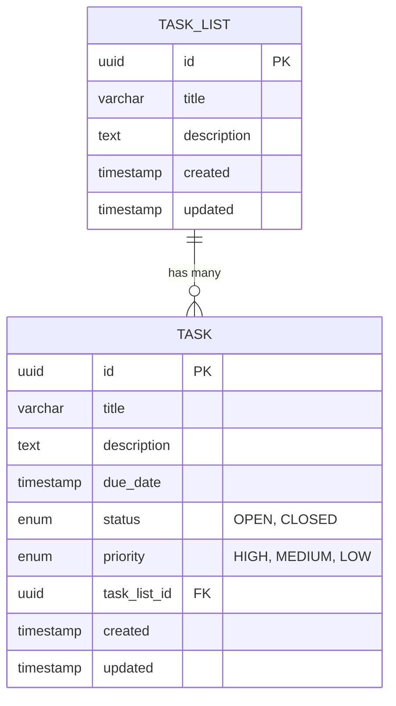

# Task Tracker API

A REST API for managing tasks and to-do lists. Built with Spring Boot and PostgreSQL.

## What it does

This is a task management API where you can:
- Create lists to organize your tasks
- Add tasks with different priorities(high, medium, low)
- Mark tasks as open or closed
- Set due dates
- Update or delete anything

I built this to practice working with Spring Boot, REST APIs, and databases.

## Tech Stack

- Java & Spring Boot
- PostgreSQL (runs in Docker)
- JPA/Hibernate for database
- Maven
- Postman for testing

## Database Schema



## Getting Started

### What you need
- Java 17+
- Docker
- Maven

### How to run

1. Clone the repo
```bash
git clone https://github.com/candanbalcii/tasktracker.git
cd tasktracker
```

2. Start the database
```bash
docker-compose up -d
```

3. Run the app
```bash
mvn spring-boot:run
```

The API will be running at `http://localhost:8080`

### Testing

I've included a Postman collection in the `postman/` folder. Just import it and you can test all the endpoints.

Or use any HTTP client - the base URL is `http://localhost:8080`

## API Endpoints

**Task Lists:**
- `GET /api/task-lists` - Get all lists
- `POST /api/task-lists` - Create a list
- `GET /api/task-lists/{id}` - Get one list
- `PUT /api/task-lists/{id}` - Update a list
- `DELETE /api/task-lists/{id}` - Delete a list

**Tasks:**
- `GET /api/tasks` - Get all tasks
- `POST /api/tasks` - Create a task
- `GET /api/tasks/{id}` - Get one task
- `PUT /api/tasks/{id}` - Update a task
- `DELETE /api/tasks/{id}` - Delete a task

